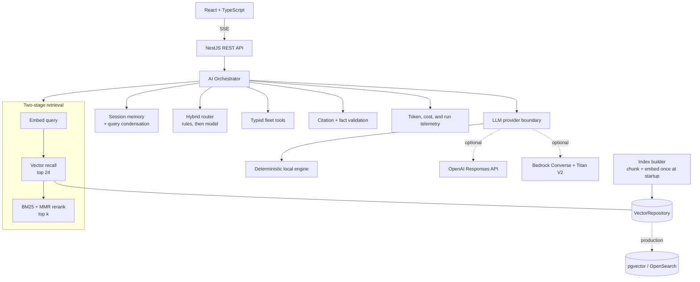

# OpsPilot AI

> A fleet operations copilot that makes the whole AI pipeline inspectable: intent routing, chunking, embeddings, two-stage retrieval, tool calling, grounded generation, structured classification, and an evaluation harness that gates CI.

OpsPilot AI helps an operations team ask questions about live fleet activity and internal procedures. It runs fully offline with a deterministic local engine, then switches to OpenAI or AWS Bedrock through configuration without changing the product or any service contract.

## Why this project

Most AI demos stop at a chat box. OpsPilot exposes the engineering behind the answer, and measures it.

- **LLM integration** — OpenAI Responses API or Amazon Bedrock Converse, behind one application-owned boundary.
- **Tool calling** — five allow-listed, JSON-Schema-typed fleet operations the model can invoke, with an agentic loop on both providers.
- **Prompt engineering** — a versioned prompt registry, injection-isolated context, and an explicit output contract.
- **Embeddings and vector search** — a `VectorRepository` interface over a flat in-memory index, OpenAI embeddings, or Titan Text Embeddings V2.
- **RAG** — recursive chunking with overlap, dense recall, BM25 + MMR reranking, inline citations, and citation validation.
- **Conversational memory** — sessions with token-budgeted history and follow-up query condensation.
- **Streaming** — server-sent events for route, retrieval, tool, and token events.
- **Classification** — incident category, subtype, severity, escalation requirement, and recommended action.
- **Summarization** — generated only from computed facts, with a fact-consistency guard that rejects invented numbers.
- **Evaluation** — a golden set scoring routing accuracy, recall@k, MRR, per-class F1, citation precision, and summary faithfulness.
- **Observability** — token and cost accounting, per-run telemetry, and a full execution trace on every answer.

## Product tour

| Workspace | What it demonstrates |
| --- | --- |
| **Overview** | KPIs aggregated from vehicle records, a computed shift briefing, trends, and live AI health |
| **Copilot** | Streaming answers, intent routing, tool calls, citations, confidence, token cost, and the retrieval trace |
| **Knowledge** | Semantic search over SOP chunks with separate vector and BM25 component scores |
| **Incidents** | Structured classification, severity triage, similar-incident retrieval, and next actions |

Try these prompts in the copilot:

- `What is the escalation procedure for a tyre breakdown?`
- `How many vehicles are delayed right now?` — answered by a typed tool, not by the model guessing
- `Which incidents are nearing SLA?`
- `Summarize today's fleet operations.` then `What about the second one?` — the follow-up is condensed against the session

## Architecture



### Request flow

```text
message → resolve session → condense follow-up → route intent
        → embed query (1 call) → vector recall → BM25 + MMR rerank
        → call typed tools → grounded prompt → generate (streamed)
        → validate citations and numbers → answer + sources + tools + usage + trace
```

The model never receives permission to execute arbitrary SQL. Operational data is reachable only through five typed, allow-listed tools whose arguments are re-validated server-side, and the daily summary receives computed facts rather than raw records.

## What the local engine is, and is not

Local mode is deliberately deterministic so a reviewer can clone the repository and see every workflow without buying API credits. It normalizes fleet-domain synonyms, builds 256-dimension hashed bag-of-words vectors, ranks with cosine plus BM25, and generates from rule-based templates.

It is a real pipeline with a fake model. Retrieval, reranking, scoring, citations, tool execution, and traces are genuine; generation is templated. The evaluation numbers below are correspondingly a regression baseline for a deterministic engine, not a claim about hosted-model quality — run `pnpm eval` with a provider configured to measure that.

## Quick start

Requirements: Node.js 20+ and pnpm 10+.

```bash
pnpm install
cp .env.example .env
pnpm dev
```

Open [http://localhost:5173](http://localhost:5173). The API runs at [http://localhost:4000/api](http://localhost:4000/api) with interactive docs at `/api/docs`.

Local demo mode is the default; no API key is required.

## Enable OpenAI

```env
AI_PROVIDER=openai
OPENAI_API_KEY=your_key
OPENAI_MODEL=gpt-5-mini
OPENAI_EMBEDDING_MODEL=text-embedding-3-small
```

Generation uses the [Responses API](https://developers.openai.com/api/reference/resources/responses/methods/create) with function tools; embeddings use LangChain's `OpenAIEmbeddings` adapter. API keys are read only by the server and never reach the browser. If a hosted call fails, the API reports the active provider honestly and uses the local engine only when `AI_ALLOW_FALLBACK` permits it.

## Enable AWS Bedrock

```env
AI_PROVIDER=aws
AWS_REGION=us-east-1
AWS_BEDROCK_MODEL_ID=amazon.nova-lite-v1:0
AWS_BEDROCK_EMBEDDING_MODEL_ID=amazon.titan-embed-text-v2:0
AWS_BEDROCK_EMBEDDING_DIMENSIONS=1024
```

The AWS SDK uses its standard credential provider chain, so local profiles, environment credentials, ECS task roles, and EC2 instance roles all work without application-specific credential code. The configured identity needs `bedrock:InvokeModel` on both models. Generation uses `ConverseCommand` with a tool configuration, streaming uses `ConverseStreamCommand`, and embeddings use `InvokeModelCommand` with normalized Titan V2 vectors.

Switching the embedding model invalidates the index: stored vectors are only comparable to vectors from the same model. The index builder detects the change and rebuilds, and the vector store throws on a dimension mismatch rather than returning a plausible-looking meaningless score.

## Evaluation

```bash
pnpm eval
```

The golden set runs against the real dependency-injected pipeline and writes a JSON report tagged with provider, model, prompt version, dataset version, latency, tokens, and cost. The same harness runs in CI as a regression gate.

Current scores on the deterministic local engine (`golden@1.1.0`, `opspilot-prompts@2.1.0`):

| Capability | Metric | Score |
| --- | --- | --- |
| Intent routing | accuracy / macro F1 | 100% / 1.00 (28 cases) |
| Retrieval | recall@1 / recall@3 / MRR | 95.7% / 100% / 0.978 (23 cases) |
| Classification | category accuracy / macro F1 | 100% / 1.00 (14 cases) |
| Classification | severity accuracy | 100% |
| Classification | **mandatory escalation recall** | **100%** |
| Grounding | citation precision | 100% |
| Summarization | fact consistency | 100% |

Three of those thresholds are correctness requirements rather than quality targets, and CI fails on any drop: escalation recall, citation precision, and summary fact consistency. The rest carry headroom so ordinary variation does not fail a build.

The harness earns its keep. Writing it immediately surfaced three real defects: a fact-consistency guard that counted digits inside incident IDs as unsupported numbers, a classifier that missed a fire described as "burning smell and glowing", and a router that dropped colloquial guidance questions to `GENERAL`.

## API surface

| Method | Endpoint | Purpose |
| --- | --- | --- |
| `GET` | `/api/health` | API, provider, and vector-index readiness (public) |
| `GET` | `/api/overview` | Aggregated KPIs, computed briefing, trends, AI health |
| `POST` | `/api/ai/chat` | Grounded answer with citations, tool calls, usage, and trace |
| `POST` | `/api/ai/chat/stream` | The same answer over server-sent events |
| `GET` | `/api/ai/search` | Two-stage semantic search with component scores |
| `POST` | `/api/ai/classify` | Structured incident classification and recommended action |
| `GET` | `/api/ai/telemetry` | Run counts, latency percentiles, grounding rate, token cost |
| `DELETE` | `/api/ai/session/:id` | Clear a conversation session |
| `GET` | `/api/incidents` | Seeded incident history |
| `GET` | `/api/documents` | Indexed knowledge-base inventory |

Every route except `/api/health` is rate limited, and requires an `x-api-key` header when `OPSPILOT_API_KEY` is set.

## Project structure

```text
opspilot-ai/
├── apps/
│   ├── api/
│   │   └── src/
│   │       ├── ai/          # orchestration, retrieval, reranking, tools, providers
│   │       ├── eval/        # golden set, metrics, harness, CLI runner
│   │       ├── fleet/       # synthetic records and typed query operations
│   │       ├── overview/    # composes fleet facts with AI health
│   │       └── telemetry/   # per-run AI telemetry
│   └── web/                 # React command center, copilot, search, incidents
├── docs/                    # architecture and evaluation notes
├── .env.example
└── pnpm-workspace.yaml
```

## Quality checks

```bash
pnpm typecheck
pnpm lint
pnpm test     # 111 unit + 15 e2e API tests, 9 web tests, including the eval gate
pnpm build
pnpm eval     # full metric report
```

## Production evolution

The demo keeps infrastructure light, but its boundaries are drawn where they need to be:

1. Implement `VectorRepository` against PostgreSQL + pgvector or Amazon OpenSearch Serverless and rebind one provider token in `AiModule`. Nothing above it changes.
2. Replace the in-process `ConversationService` and `AiTelemetryService` with durable stores keyed by user.
3. Add authenticated document ingestion and background chunking, reusing `ChunkingService`.
4. Persist evaluation reports and chart the metrics across prompt and model versions.
5. Move rate limiting to the edge and swap the API key guard for real identity.

All fleet records and operating procedures are synthetic. Vehicles are generated deterministically from a fixed seed, and incidents are anchored to process start so a fresh clone always shows a live shift with meaningful SLA countdowns.
